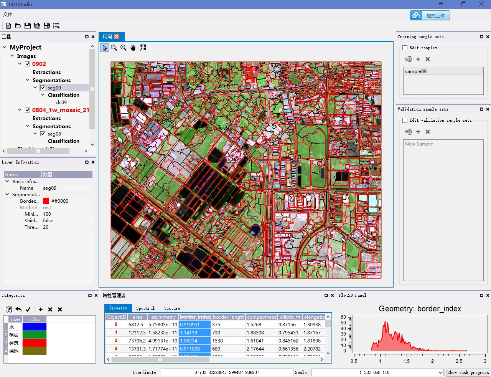

Introduction
==

**CDTStudio** is an open-source and cross-platform desktop software in object-based image analysis (OBIA or GeoOBIA). The first version of it is written by Chen Guanzhou ([English](https://github.com/chenguanzhou), [中文](http://www.chenguanzhou.com/about)).

**CDTStudio** is based on Qt4 framework, in which most algorithms are in the form of plugins. **CDTStudio** can be run in Windows & Ubuntu (Other linux distributions and MacOS have not been tested).

It contains the following GeoOBIA framework:

- Remote sensing image segmentation
- Object-based image analysis (OBIA) & Object-based image classification (OBIC)
- Pixel-based change detection (PBCD) & Object-based change detection (OBCD)
- Semi-automatic feature extraction by Snakes
- ......

Documentation
==
[http://cdtstudio.chenguanzhou.com](http://cdtstudio.chenguanzhou.com)

Scrennshot
==

3rdParty
==
[Qt](http://qt.io/)

[QGIS](http://qgis.org)

[GDAL](http://gdal.org/)

[OpenCV](http://opencv.org/)

[Boost](http://www.boost.org/)

[Log4Qt](http://log4qt.sourceforge.net/)

[Qwt](http://qwt.sourceforge.net/)

[wwWidgets](http://www.wysota.eu.org/wwwidgets/)

[STXXL](http://stxxl.sourceforge.net/)

[QPropertyEditor](https://github.com/chenguanzhou/QPropertyEditor)

License
==
**CDTStudio** is released under GPLv3.

Special Thanks
==
[Cui Weihong](http://202.114.121.185/resume/view.aspx?id=45)